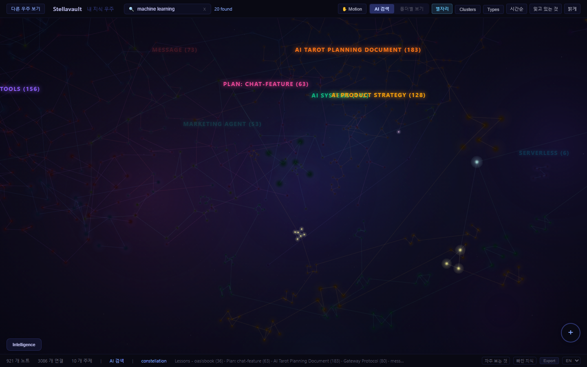

<div align="center">

# ✦ Stellavault

**Drop anything. It compiles itself into knowledge.**<br/>
The local-first second brain that **Claude remembers** — no cloud, no API keys, your files untouched.

[](https://github.com/Evanciel/stellavault/actions/workflows/ci.yml) [](https://www.npmjs.com/package/stellavault) []() []() [](LICENSE)

**English** · [한국어](README.ko.md) · [日本語](README.ja.md) · [简体中文](README.zh.md)

[**⬇ Download Desktop App**](https://github.com/Evanciel/stellavault/releases/tag/desktop-v0.1.0) · [Quickstart](#install) · [MCP Setup](#mcp-integration-21-tools) · [Live Demo](https://evanciel.github.io/stellavault/)

</div>

Self-compiling knowledge base with a full-featured editor, 3D neural graph, AI-powered search, and spaced repetition — available as a **desktop app**, **CLI**, **Obsidian plugin**, and **MCP server**. Your vault files are never modified.

<p align="center">
  
  <br><em>Your vault as a neural network. Local-first, no cloud required.</em>
</p>

## Contents

[Install](#install) · [Editor](#editor) · [Pipeline](#the-pipeline) · [Intelligence](#intelligence-what-makes-stellavault-unique) · [Search & Ranking](#search--ranking) · [MCP Integration](#mcp-integration-21-tools) · [3D Visualization](#3d-visualization) · [Configuration](#configuration) · [Performance](#performance) · [Tech Stack](#tech-stack) · [Security](#security) · [Troubleshooting](#troubleshooting)

## Install

### Desktop App (Recommended — one click)

<table>
  <tr>
    <td align="center"><a href="https://github.com/Evanciel/stellavault/releases/download/desktop-v0.1.0/Stellavault-win32-x64-0.1.0.zip"><br/><b>⬇ Download for Windows</b><br/><sub>x64 · 116 MB · ZIP</sub></a></td>
    <td align="center"><a href="https://github.com/Evanciel/stellavault/releases/download/desktop-v0.1.0/Stellavault-linux-x64-0.1.0.zip"><br/><b>⬇ Download for Linux</b><br/><sub>x64 · 107 MB · ZIP</sub></a></td>
    <td align="center"><br/><b>macOS</b><br/><sub>Coming soon</sub></td>
  </tr>
</table>

> Download → Unzip → Run `stellavault.exe` (Windows) or `stellavault` (Linux) → Pick your notes folder → Done.

### CLI (for developers)

```bash
npm install -g stellavault    # or: npx stellavault
stellavault init              # Interactive setup (3 min): index vault + connect AI clients
stellavault setup             # Connect to Claude Code/Desktop, Cursor, Windsurf, VS Code (one command)
stellavault graph             # Launch 3D graph in browser
```

> Requires Node.js 20+. Run `stellavault doctor` to diagnose issues.

### Obsidian Plugin

1. Download `main.js` + `manifest.json` + `styles.css` from [stellavault-obsidian releases](https://github.com/Evanciel/stellavault-obsidian/releases/latest)
2. Place in `.obsidian/plugins/stellavault/`
3. Enable in Settings → Community plugins
4. Start API: `npx stellavault graph` in your vault folder

---

## Editor

Full-featured markdown editor — on par with Obsidian.

| Feature | Status |
|---------|--------|
| Bold, Italic, Underline, Strikethrough | ✅ |
| Headings 1–6 | ✅ |
| Bullet, Numbered, Task lists (nested checkboxes) | ✅ |
| Tables (create, resize columns, add/remove rows & cols) | ✅ |
| Code blocks with syntax highlighting (40+ languages) | ✅ |
| Images (URL, clipboard paste, drag & drop) | ✅ |
| KaTeX math rendering (`$E=mc^2$` inline, `$$...$$` display) | ✅ |
| `/Slash commands` (12 block types, fuzzy search) | ✅ |
| `[[Wikilink]]` autocomplete | ✅ |
| Split view (vertical + horizontal, Ctrl+\\) | ✅ |
| Text alignment (left / center / right) | ✅ |
| Highlight, Superscript, Subscript | ✅ |
| Smart typography (curly quotes, em/en dashes) | ✅ |
| Horizontal rules | ✅ |

---

## The Pipeline

```
Capture ──→ Organize ──→ Distill ──→ Express

Drop anything → auto-extract → raw/ → compile → _wiki/ → draft
```

Inspired by Karpathy's self-compiling knowledge architecture.

### Ingest 14 Formats

| Input | How |
|-------|-----|
| PDF, DOCX, PPTX, XLSX | `stellavault ingest report.pdf` |
| JSON, CSV, XML, YAML, HTML, RTF | `stellavault ingest data.json` |
| YouTube | `stellavault ingest https://youtu.be/...` — transcript + timestamps |
| URL | `stellavault ingest https://...` — HTML → markdown |
| Text | `stellavault ingest "quick thought"` |
| Folder | `stellavault ingest ./papers/` — batch all files |
| Desktop / Web UI | Drag & drop files directly |

### Express: Get Knowledge Out

```bash
stellavault draft "AI" --format blog      # Blog post from your vault
stellavault draft "AI" --format outline   # Structured outline
stellavault draft "AI" --ai              # Claude API enhanced ($0.03)
```

Or use the **Express tab** in the desktop app — enter a topic, pick a format, and generate a draft grounded in your vault. Save to `_drafts/` and edit inline.

---

## Intelligence (What Makes Stellavault Unique)

These features do **not exist** in Obsidian — even with plugins.

| Feature | Command / Desktop | Description |
|---------|-------------------|-------------|
| **Memory Decay** | `stellavault decay` / Memory tab | FSRS-based — shows which real notes you are forgetting |
| **Knowledge Gaps** | `stellavault gaps` | Detects weak connections between topic clusters |
| **Contradictions** | `stellavault contradictions` | Finds conflicting statements across your vault |
| **Duplicates** | `stellavault duplicates` | Near-identical notes with similarity score |
| **Health Check** | `stellavault lint` | Aggregated vault health score (0–100) |
| **Learning Path** | `stellavault learn` | AI-personalized review recommendations |
| **Daily Brief** | Desktop app home screen | Push-type: top decaying notes + stats on app open |
| **Auto-Tagging** | Automatic on ingest | Content-based keyword extraction + category rules |
| **Self-Compiling** | `stellavault compile` | raw/ → _wiki/ with extracted concepts + backlinks |

---

## Search & Ranking

Hybrid retrieval that fuses multiple signals with **weighted Reciprocal Rank Fusion (RRF)** — tuned for a personal knowledge vault, fully local, zero API keys:

| Signal | What it captures | Default weight |
|--------|------------------|---------------:|
| **Semantic** (dense) | meaning; multilingual (50+ languages) | `1.0` |
| **BM25** (keyword) | exact terms, code, names | `1.0` |
| **Entity-linking** | your `[[wikilinks]]`, `#tags`, headings, titles — the curated graph | `1.5` |
| **FSRS recency** | gently surfaces notes you're actively using / forgetting | `±10%` |

- **Entity matching** resolves natural-language queries via fuzzy substring + punctuation-normalized matching (Korean / CJK friendly), with a **per-document diversity cap** so one large note can't flood the top results.
- **Recency** reuses the same FSRS memory model as the decay engine (not raw file mtime) — a note you're forgetting resurfaces; a mastered evergreen note isn't buried just for being old.
- **Adaptive rerank** (long-running MCP server) further boosts results by your current session context (recent tags / paths).
- Every weight is **tunable** per vault or via env vars — see [Configuration](#configuration).

---

## MCP Integration (21 Tools)

```bash
stellavault setup            # one command → Claude Code, Claude Desktop, Cursor, Windsurf, VS Code
# or, for Claude Code only:
claude mcp add stellavault -- stellavault serve
```

Claude can search, ask, draft, lint, and analyze your vault directly. Search runs
the full hybrid pipeline — **weighted RRF** over semantic + BM25 + entity-linking,
plus **FSRS recency** and session-adaptive reranking (see [Search & Ranking](#search--ranking)).

| Tool | What it does |
|------|-------------|
| `search` | Weighted RRF (semantic + BM25 + entity) + FSRS recency + adaptive rerank |
| `ask` | Vault-grounded Q&A |
| `generate-draft` | AI drafts from your knowledge |
| `get-decay-status` | Memory decay report (FSRS) |
| `detect-gaps` | Knowledge gap analysis |
| `create-knowledge-node` | AI creates wiki-quality notes |
| `federated-search` | P2P search across vaults |
| + 14 more | Documents, topics, decisions, snapshots, export |

---

## 3D Visualization

- Neural graph with cluster coloring (React Three Fiber)
- Constellation view (MST star patterns)
- Heatmap overlay + Timeline slider + Decay overlay
- Multiverse view — your vault as a universe in a P2P network
- Dark/Light theme

<table>
  <tr>
    <td width="50%"><br/><sub><b>Heatmap</b> — connection density across clusters</sub></td>
    <td width="50%"><br/><sub><b>Timeline</b> — watch your vault grow over time</sub></td>
  </tr>
  <tr>
    <td><br/><sub><b>Search</b> — semantic matches highlighted in-graph</sub></td>
    <td><br/><sub><b>Multiverse</b> — federated vaults as orbiting universes</sub></td>
  </tr>
</table>

---

## Try It Now (Demo Vault)

```bash
npx stellavault index --vault ./examples/demo-vault   # Index 10 sample notes
npx stellavault search "vector database"               # Semantic search
npx stellavault graph                                  # 3D graph visualization
```

The demo vault includes interconnected notes about Vector Databases, Knowledge Graphs, Spaced Repetition, RAG, MCP, and more — perfect for exploring all features instantly.

---

## Getting Started Guide

### Desktop App

1. **Download** → Unzip → Run
2. First launch asks you to pick your notes folder
3. Your notes appear in the sidebar — click to open
4. Press `Ctrl+P` for quick file switching
5. Click ✦ in the title bar for AI panel (semantic search, stats, draft)
6. Click ◉ for 3D graph

### CLI

```bash
npm install -g stellavault
stellavault init                          # Setup wizard
stellavault search "machine learning"     # Semantic search
stellavault ingest paper.pdf              # Add knowledge
stellavault graph                         # 3D graph in browser
stellavault brief                         # Morning briefing
stellavault decay                         # What are you forgetting?
```

### Keyboard Shortcuts (Desktop)

| Shortcut | Action |
|----------|--------|
| `Ctrl+P` | Quick Switcher (fuzzy file search) |
| `Ctrl+Shift+P` | Command Palette (all actions) |
| `Ctrl+S` | Save current note |
| `Ctrl+\` | Toggle split view |
| `Ctrl+B` | Bold |
| `Ctrl+I` | Italic |
| `Ctrl+U` | Underline |
| `Ctrl+E` | Inline code |
| `/` | Slash commands (at start of line) |
| `[[` | Wikilink autocomplete |

### Quick Reference

| Action | Desktop | CLI |
|--------|---------|-----|
| Search notes | Ctrl+P or AI panel | `stellavault search "query"` |
| Add a note | + Note button or drag & drop | `stellavault ingest "text"` |
| See 3D graph | ◉ button | `stellavault graph` |
| Memory decay | AI panel → Memory | `stellavault decay` |
| Generate draft | AI panel → Draft | `stellavault draft "topic"` |
| Health check | AI panel → Stats | `stellavault lint` |

---

## Configuration

Stellavault reads `./.stellavault.json` (or `~/.stellavault.json`). Search ranking is fully tunable — sensible defaults work out of the box:

```jsonc
{
  "search": {
    "rrfK": 60,
    "weights": { "semantic": 1.0, "bm25": 1.0, "entity": 1.5 },
    "recencyWeight": 0.2,                          // FSRS recency strength; 0 = off
    "entityAliases": { "k8s": ["kubernetes"] }     // synonym / cross-lingual groups (exact-only)
  }
}
```

Environment variables override config (parsed with guards):

| Env var | Effect |
|---------|--------|
| `STELLAVAULT_W_SEMANTIC` / `_BM25` / `_ENTITY` | per-signal RRF weight (e.g. `STELLAVAULT_W_ENTITY=2.0` for aggressive entity surfacing) |
| `STELLAVAULT_RECENCY_WEIGHT` | recency strength `0`–`1` (`0` disables) |
| `STELLAVAULT_DB_PATH` | override the index DB location |
| `STELLAVAULT_WATCH` | `0` to disable the auto-reindex file watcher while `serve` runs |

> Note: cross-lingual recall (e.g. a Korean query finding English notes) is handled automatically by the multilingual embedding model — `entityAliases` is an optional precision boost for the curated entity graph (tags / wikilinks) and abbreviations.

---

## Performance

Tested on synthetic vaults — all operations under 1 second for typical use cases:

| Operation | 100 docs | 500 docs | 1000 docs |
|-----------|----------|----------|-----------|
| Store init | 15ms | 15ms | 16ms |
| Bulk upsert | 12ms | 102ms | ~200ms |
| Search (BM25) | <1ms | <1ms | <1ms |
| Get all docs | <1ms | 2ms | ~4ms |
| 124K dot products | — | 36ms | — |

Run your own benchmarks:

```bash
node tests/stress.mjs 500     # Test with 500 synthetic documents
```

Key optimizations:
- **HNSW graph building** — sqlite-vec KNN for 200+ docs (O(n·K·log n) vs O(n²))
- Pre-normalized vectors: cosine similarity → single dot product
- Batched embedding loading (500/batch, prevents RAM overflow)
- Upper-triangle brute-force for small vaults (< 200 docs)
- O(n) K-Means centroid updates with typed arrays

---

## Tech Stack

| Layer | Tech |
|-------|------|
| Desktop | Electron + React + TipTap (15 extensions) + Zustand |
| Runtime | Node.js 20+ (ESM, TypeScript) |
| Vector Store | SQLite-vec (local, zero config) |
| Embedding | MiniLM-L12-v2 (local, 50+ languages, batch processing) |
| Search | Weighted RRF (semantic + BM25 + entity) + FSRS recency |
| Math | KaTeX (inline + display) |
| Code | lowlight / highlight.js (40+ languages) |
| 3D | React Three Fiber + Three.js |
| AI | MCP (21 tools) + Anthropic SDK |
| P2P | Hyperswarm (optional, differential privacy) |
| CI | GitHub Actions (Node 20 + 22) |

---

## Security

- **Local-first** — no data leaves your machine unless you use `--ai`
- **Vault files never modified** — indexes into SQLite, originals untouched
- **Electron sandbox enabled** — renderer runs with reduced OS privileges
- **IPC path validation** — all file operations stay inside vault root
- **API auth token** — per-session, header-only (`X-Stellavault-Token`). Token endpoint is same-origin-only
- **CORS allow-list** — `localhost` / `127.0.0.1` only by default; MCP HTTP transport opt-in
- **SSRF protection** — private IPs blocked on URL ingest
- **E2E encryption** — AES-256-GCM for cloud sync

### Federation (experimental, off by default)

Peer-to-peer semantic search is shipped as an **opt-in experimental feature**. The default install does **not** join any swarm and never shares data.

Enable explicitly:

```bash
# PowerShell
$env:STELLAVAULT_FEDERATION_EXPERIMENTAL = "1"

# bash / zsh
export STELLAVAULT_FEDERATION_EXPERIMENTAL=1

stellavault federate join
```

When enabled, federation uses Ed25519 identities with signed envelopes, mutual challenge-response handshake, per-envelope replay nonces, handshake timeout, per-peer rate limiting, and a receive-only sharing default (`myNodeLevel=0`). Run `set-level 1+` in the federation prompt to actually share titles/snippets with peers.

> **Upgrade note (v0.7.4)** — federation wire format bumped from v2.0 to v2.1 (envelope-level nonce). v0.7.3 federation nodes are not compatible. Existing `~/.stellavault/federation/sharing.json` files are **not** auto-downgraded to the safer defaults; review your `myNodeLevel` if you previously opted in.

See [SECURITY.md](SECURITY.md) for full details.

## Troubleshooting

```bash
stellavault doctor    # Check config, vault, DB, model, Node version
```

Common issues:
- **"Command not found"** → `npm i -g stellavault@latest`
- **"API server not found"** → `npx stellavault graph`
- **Empty graph** → `stellavault index`
- **Slow first run** → AI model downloads ~30MB once

## Contributing

Issues and pull requests are welcome. See [CONTRIBUTING.md](CONTRIBUTING.md) to get started, and [SECURITY.md](SECURITY.md) to report a vulnerability responsibly.

## License

MIT — full source code available for audit.

## Links

- **[⬇ Download Desktop App](https://github.com/Evanciel/stellavault/releases/tag/desktop-v0.1.0)**
- [Landing Page](https://evanciel.github.io/stellavault/)
- [Obsidian Plugin](https://github.com/Evanciel/stellavault-obsidian)
- [npm](https://www.npmjs.com/package/stellavault)
- [GitHub Releases](https://github.com/Evanciel/stellavault/releases)
- [Security Policy](SECURITY.md)
