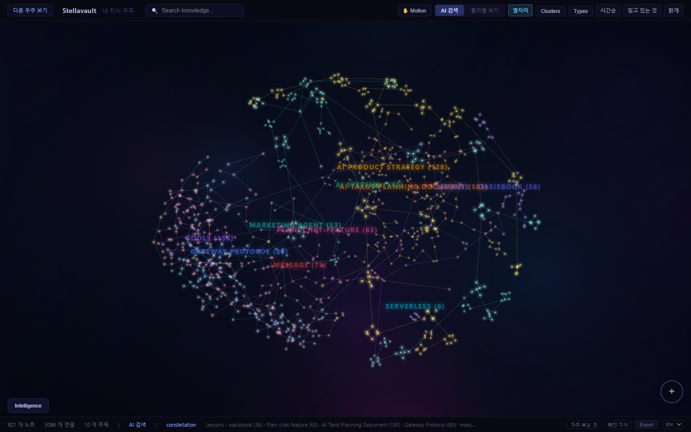
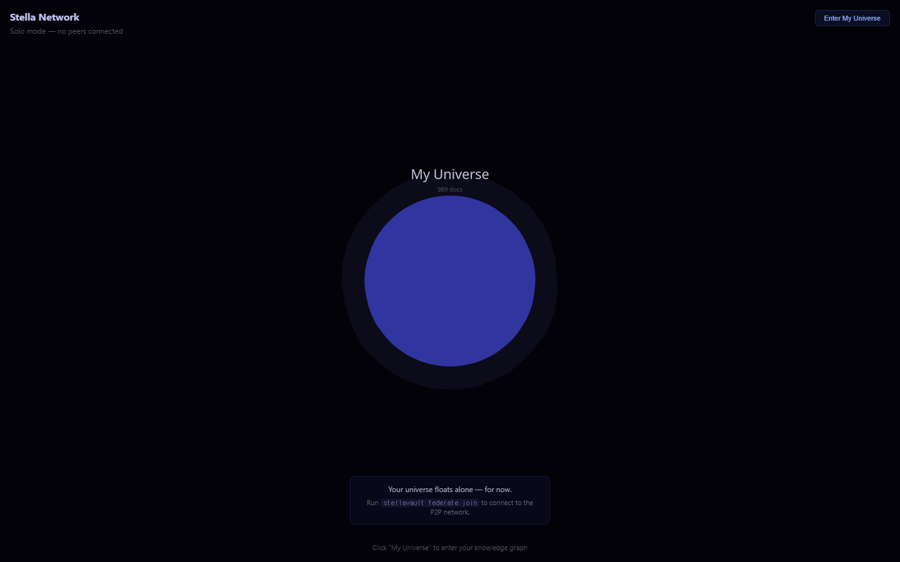

# Stellavault

> **Drop anything. It compiles itself into knowledge.** Claude remembers everything you know.

Self-compiling Zettelkasten MCP server. Ingest PDFs, YouTube, documents — auto-organized into linked wiki. Claude accesses your entire knowledge base. **Your vault files are never modified.**

<p align="center">
  
  <br><em>Your vault as a neural network. Local-first, no cloud required.</em>
</p>

## Two Core Ideas

**1. "Drop it and forget it"** (Inspired by Karpathy's Self-Compiling Knowledge)
```
Any input → auto-classify → raw/ → compile → wiki → connected knowledge
```
PDF, DOCX, PPTX, XLSX, YouTube (with transcript), URL, text — everything goes through the same pipeline. You never manually organize.

**2. "Claude remembers what you know"** (MCP Integration)
```bash
claude mcp add stellavault -- stellavault serve
```
Claude searches, asks, drafts from your vault directly. Local-first — no data leaves your machine.

## 5-Minute Setup

```bash
npm install -g stellavault
stellavault init          # Interactive setup + vault indexing
stellavault graph         # Launch 3D graph + API server
```

> **Prerequisites**: Node.js 20+

## The Pipeline

```
Capture ──→ Organize ──→ Distill ──→ Express

stellavault ingest <anything>     # PDF, DOCX, URL, YouTube, text
  → auto-extract text             # unpdf, mammoth, yt-dlp
  → raw/ (fleeting)               # Zettelkasten inbox
  → compile → _wiki/              # Auto: concepts + backlinks
  → stellavault draft "topic"     # Blog, report, or outline
```

### Ingest Anything

| Input | How |
|-------|-----|
| PDF, DOCX, PPTX, XLSX | `stellavault ingest report.pdf` — auto text extraction |
| YouTube | `stellavault ingest https://youtu.be/...` — transcript + timestamps |
| URL | `stellavault ingest https://...` — HTML → clean text |
| Text | `stellavault ingest "quick thought"` |
| Web UI | Drag & drop files in browser (mobile too) |

### Express: Get Knowledge Out

```bash
stellavault draft "AI"                    # Rule-based scaffold (free)
stellavault draft "AI" --ai               # Claude API writes full draft ($0.03)
stellavault draft "AI" --format report    # Formal report format
stellavault draft --format outline        # All-knowledge outline
```

Or in Claude Code: *"Write a blog post about machine learning from my notes"* — Claude uses MCP `generate-draft` tool (free, no API key).

## Self-Evolving Memory (Karpathy's Compounding Loop)

```
Session → session-save → daily-log → flush → wiki
  ↑                                            ↓
  └──── Claude reads wiki via MCP (20 tools) ←─┘
```

Every conversation makes your knowledge base smarter:

```bash
# Auto-capture session summary to daily log
echo "Decided to use JWT. Lesson: never store tokens in localStorage" | stellavault session-save

# Flush daily logs → extract concepts → rebuild wiki
stellavault flush

# Or set up Claude Code hooks for full automation
# See: docs/hooks-setup.md
```

## Daily Commands

```bash
stellavault ask "What did I learn about X?"   # Q&A from vault
stellavault brief                              # Morning knowledge briefing
stellavault decay                              # What's fading from memory?
stellavault lint                               # Health score (0-100)
stellavault learn                              # AI learning path
stellavault flush                              # Daily logs → wiki compilation
stellavault digest --visual                    # Weekly Mermaid chart report
```

## MCP Tools (21)

| Tool | What it does |
|------|-------------|
| `search` | Hybrid search (BM25 + vector + RRF) |
| `ask` | Q&A with optional vault filing |
| `generate-draft` | Gather vault context for AI draft writing |
| `get-document` | Full document with metadata |
| `get-related` | Semantically similar documents |
| `list-topics` | Topic cloud |
| `get-decay-status` | Memory decay report |
| `get-morning-brief` | Daily knowledge briefing |
| `get-learning-path` | AI learning recommendations |
| `detect-gaps` | Knowledge gap analysis |
| `get-evolution` | Semantic drift tracking |
| `link-code` | Code-knowledge connections |
| `create-knowledge-node` | AI creates wiki-quality notes |
| `create-knowledge-link` | AI connects existing notes |
| `log-decision` / `find-decisions` | Decision journal |
| `create-snapshot` / `load-snapshot` | Context snapshots |
| `generate-claude-md` | Auto-generate CLAUDE.md |
| `export` | JSON/CSV export |
| `federated-search` | P2P federated search |

## Self-Evolving Commands

```bash
stellavault session-save              # Capture session summary to daily log
stellavault flush                     # Daily logs → wiki (Karpathy compile)
stellavault promote note.md --to lit  # Upgrade note stage
stellavault autopilot                 # Full cycle: inbox → compile → lint → archive
```

## Zettelkasten (Luhmann + Karpathy)

```bash
stellavault fleeting "raw idea"                # → raw/
stellavault ingest report.pdf                  # → auto text extract → raw/
stellavault compile                            # → raw/ → _wiki/ (concepts + backlinks)
stellavault promote note.md --to permanent     # Upgrade stage
stellavault autopilot                          # Full cycle: inbox → compile → lint → archive
```

- **3-stage flow**: fleeting → literature → permanent
- **Luhmann index codes**: auto-assigned (1A → 1A1)
- **Frontmatter-first scanning**: 10x token reduction
- **Configurable folders**: override raw/_wiki/_literature/ in `.stellavault.json`

```json
{
  "vaultPath": "/path/to/vault",
  "folders": {
    "fleeting": "01-Inbox",
    "literature": "02-Reading",
    "permanent": "03-Notes",
    "wiki": "04-Wiki"
  }
}
```

## Intelligence

| Feature | Command |
|---------|---------|
| FSRS Decay | `sv decay` — spaced repetition memory tracking |
| Gap Detection | `sv gaps` — missing connections between topics |
| Contradictions | `sv contradictions` — conflicting statements |
| Duplicates | `sv duplicates` — redundant notes |
| Learning Path | `sv learn` — AI review recommendations |
| Code Linker | MCP `link-code` — connect code to knowledge |

## 3D Visualization

- Neural graph with cluster coloring
- Constellation view (MST star patterns)
- Heatmap overlay (activity score)
- Timeline slider (creation/modification filter)
- Decay overlay (fading knowledge)
- **Multiverse view** — your vault as a universe in a P2P network
- Dark/Light theme
- Mobile responsive + PWA installable

## Multiverse — P2P Knowledge Federation

<p align="center">
  
  <br><em>"Your universe floats alone — for now."</em>
</p>

Your vault is a universe. Connect with others through P2P federation.

```bash
stellavault federate join    # Connect to the Stella Network
stellavault federate status  # See connected peers
```

**How it works:**
- **Hyperswarm P2P** — NAT-traversal mesh networking, no central server
- **Embeddings only** — your original text never leaves your machine
- **Differential privacy** — mathematical privacy guarantees
- **Trust & reputation** — good knowledge earns credits
- **Federated search** — search across connected vaults via MCP

The Multiverse view shows your universe and connected peers as neighboring constellations in 3D. Click to explore their shared knowledge.

## Tech Stack

| Layer | Tech |
|-------|------|
| Runtime | Node.js 20+ (ESM, TypeScript) |
| Vector Store | SQLite-vec (local, no server) |
| Embedding | paraphrase-multilingual-MiniLM-L12-v2 (local, 50+ languages) |
| Search | BM25 + Cosine + RRF Fusion |
| File Parsing | unpdf, mammoth, officeparser, SheetJS |
| Memory | FSRS (Free Spaced Repetition Scheduler) |
| 3D | React Three Fiber + Three.js |
| AI | MCP (Model Context Protocol) + Anthropic SDK |

## Full Feature List

| Category | Features |
|----------|----------|
| **Capture** | ingest (URL/YouTube/PDF/DOCX/PPTX/XLSX/text), fleeting, web drag & drop, mobile PWA |
| **Organize** | Zettelkasten 3-stage, auto index codes, wikilink auto-connect, configurable folders |
| **Distill** | compile (raw→wiki), lint (health score), gaps, contradictions, duplicates |
| **Express** | draft (blog/report/outline/instagram/thread/script), blueprint, --ai, MCP generate-draft |
| **Memory** | FSRS decay, session-save, flush, compounding loop, ADR templates |
| **Search** | hybrid (BM25+vector+RRF), multilingual 50+, ask Q&A, quotes mode |
| **Visualize** | 3D graph, heatmap, timeline, right-click context menu, TipTap WYSIWYG editor |
| **AI Integration** | 21 MCP tools, Claude Code hooks, Anthropic SDK |
| **Security** | DOMPurify, YAML sanitize, 50MB guard, SSRF protection |
| **CLI** | 40+ commands, `sv` alias, batch ingest |

## Security

Your vault files are never modified. Stellavault is local-first — no data leaves your machine unless you explicitly use `--ai` (Anthropic API).

See [SECURITY.md](SECURITY.md) for full details.

## License

MIT — full source code available for audit.

## Links

- [Landing Page](https://evanciel.github.io/stellavault/)
- [Obsidian Plugin](https://github.com/Evanciel/stellavault-obsidian)
- [npm](https://www.npmjs.com/package/stellavault)
- [GitHub Releases](https://github.com/Evanciel/stellavault/releases)
- [Security Policy](SECURITY.md)
