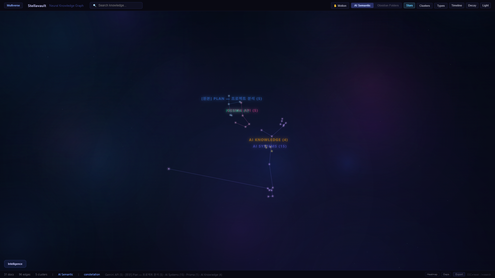
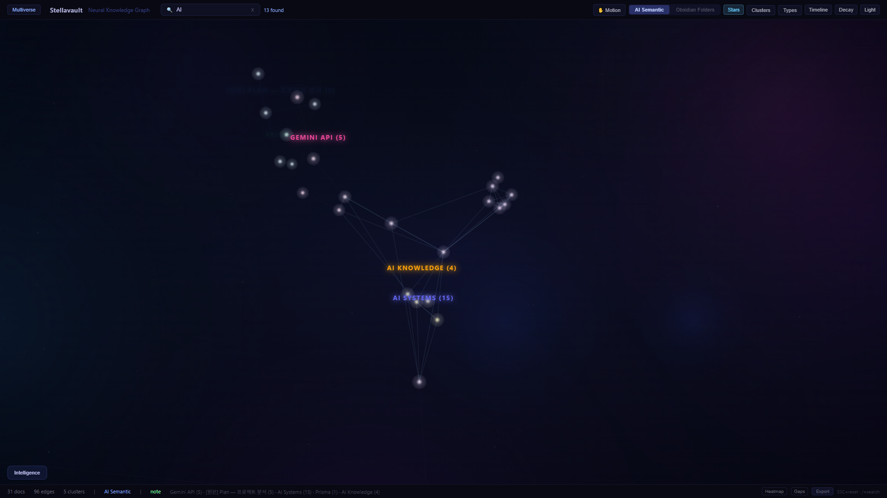
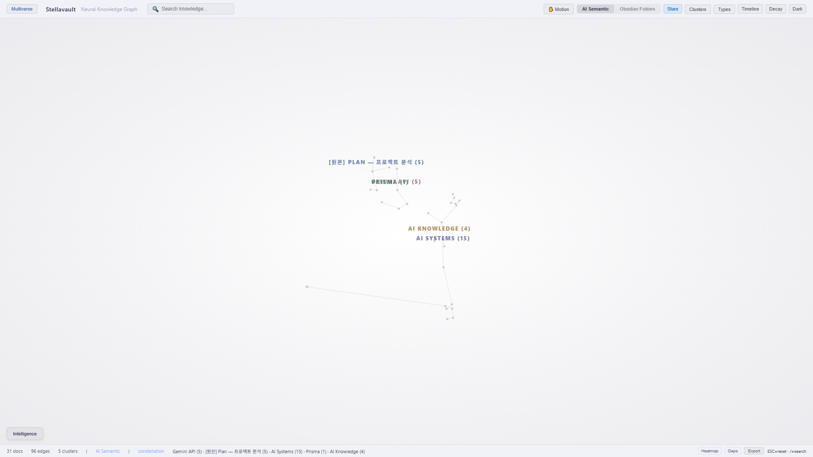
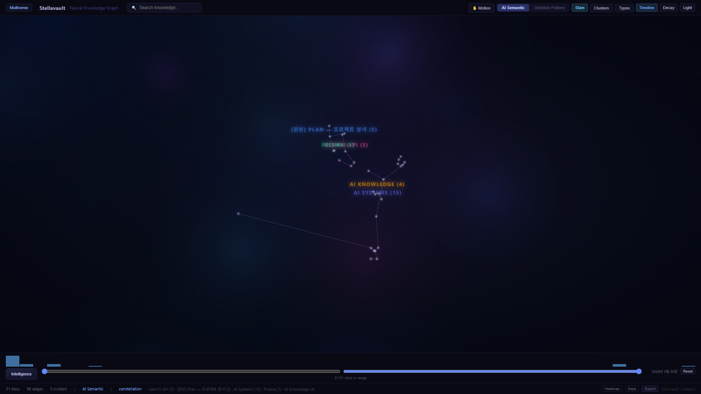
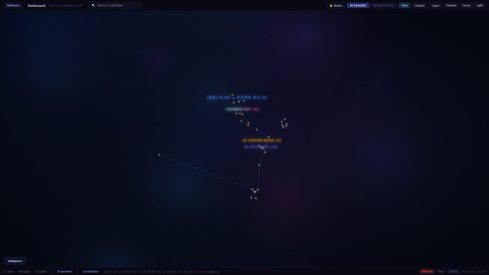

# Stellavault

> **Notes die in folders. Stellavault keeps your knowledge alive.**

Your Obsidian vault is more than files — it's a living network. Stellavault turns it into a self-compiling knowledge system that **discovers hidden connections**, **tracks fading memories**, **finds blind spots**, and **gives AI agents direct access to everything you know**.

<p align="center">
  
  <br><em>Your vault as a neural network. Clusters form constellations.</em>
</p>

## Why Stellavault?

| Problem | Stellavault Solution |
|---------|---------------------|
| Notes pile up but never become knowledge | **Self-compiling wiki** — raw notes auto-organized into linked concepts |
| You forget what you wrote | **FSRS decay tracking** — see what's fading, get review suggestions |
| Search finds words, not meaning | **Hybrid AI search** — BM25 + vector + RRF fusion, locally |
| AI agents can't access your knowledge | **17 MCP tools** — Claude remembers everything you know |
| No way to see the big picture | **3D neural graph** — constellations, heatmaps, timeline |

## 5-Minute Setup

```bash
# Install
npm install -g stellavault

# Interactive setup (indexes your vault + verifies search)
stellavault init

# Launch 3D graph + API server
stellavault graph
```

> **Prerequisites**: Node.js 20+ (`node --version`)

## Give Your AI Agent Memory

```bash
claude mcp add stellavault -- stellavault serve
```

Now Claude Code can search your notes, track decisions, detect knowledge gaps, and generate daily briefings — using 17 MCP tools.

## Screenshots

<p align="center">
  
  <br><em>Search by meaning. Matching nodes pulse and glow.</em>
</p>

<details>
<summary>More screenshots</summary>

| Light Mode | Timeline Slider | Heatmap |
|:---:|:---:|:---:|
|  |  |  |

</details>

## Core Workflow

```
Capture → Compile → Connect → Review

stellavault fleeting "idea"     # Instant capture
stellavault ingest <url>        # Clip any URL/file
stellavault compile             # Raw → structured wiki
stellavault autopilot           # Full flywheel: inbox → compile → lint
stellavault ask "question"      # Q&A with auto-filing (--save)
stellavault lint                # Knowledge health check (score 0-100)
```

## Daily Commands

```bash
stellavault brief               # Morning knowledge briefing
stellavault decay               # What's fading from memory?
stellavault learn               # AI-generated learning path
stellavault digest --visual     # Weekly report with Mermaid charts
stellavault review              # FSRS spaced repetition session
stellavault gaps                # Knowledge gap detection
```

## Intelligence Features

| Feature | Command | What it does |
|---------|---------|-------------|
| **FSRS Decay** | `sv decay` | Track memory strength with spaced repetition |
| **Gap Detection** | `sv gaps` | Find missing connections between topics |
| **Contradiction Detection** | `sv contradictions` | Spot conflicting statements |
| **Duplicate Detection** | `sv duplicates` | Find redundant notes |
| **Knowledge Lint** | `sv lint` | Health score + issues + suggestions |
| **Learning Path** | `sv learn` | AI-recommended review order |
| **Semantic Evolution** | MCP `get-evolution` | Track how ideas change over time |
| **Code Linker** | MCP `link-code` | Connect code files to knowledge notes |
| **Adaptive Search** | MCP `search` | Context-aware result reranking |

## Zettelkasten Automation

Inspired by Luhmann + Karpathy's "Self-Compiling Zettelkasten":

```bash
stellavault fleeting "raw idea"          # Capture → raw/
stellavault ingest https://article.com   # Any URL → auto-classified
stellavault compile                      # Raw → wiki with concepts + backlinks
stellavault promote file.md --to permanent  # Upgrade note stage
stellavault autopilot                    # Full cycle: inbox → compile → lint → archive
```

- **Frontmatter-first scanning** — 10x token reduction
- **Luhmann index codes** — auto-assigned hierarchical numbering (1A → 1A1)
- **Inbox Zero** — processed notes auto-archived
- **Atomicity check** — detects notes with too many topics
- **3-stage classification** — fleeting → literature → permanent

## MCP Tools (17)

| Tool | What it does |
|------|-------------|
| `search` | Hybrid search (BM25 + vector + RRF) |
| `get-document` | Full document with metadata |
| `get-related` | Semantically similar documents |
| `list-topics` | Topic cloud |
| `get-decay-status` | Memory decay report |
| `get-morning-brief` | Daily knowledge briefing |
| `get-learning-path` | AI learning recommendations |
| `detect-gaps` | Knowledge gap analysis |
| `get-evolution` | Semantic drift tracking |
| `link-code` | Code-knowledge connections |
| `ask` | Q&A with optional vault filing |
| `create-knowledge-node` | AI creates wiki-quality notes |
| `create-knowledge-link` | AI connects existing notes |
| `log-decision` / `find-decisions` | Decision journal |
| `create-snapshot` / `load-snapshot` | Context snapshots |
| `generate-claude-md` | Auto-generate CLAUDE.md |
| `export` | JSON/CSV export |

## 3D Visualization

- **Neural graph** — force-directed layout with cluster coloring
- **Constellation view** — MST-based star patterns with LOD zoom
- **Heatmap overlay** — activity score (cold → fire gradient)
- **Timeline slider** — filter by creation/modification date
- **Multiverse view** — see connected Federation peers
- **Decay overlay** — visualize fading knowledge
- **Dark/Light theme** — monochrome light mode with color-on-interaction
- **Export** — PNG screenshots + WebM recording

## Obsidian Plugin

Manual install (community plugin review pending):

1. Download `main.js`, `manifest.json`, `styles.css` from [GitHub Releases](https://github.com/Evanciel/stellavault-obsidian/releases/tag/0.1.0)
2. Copy to `.obsidian/plugins/stellavault/`
3. Enable in Settings > Community plugins
4. **Run `stellavault graph` first** — the plugin connects to the API server

Features: semantic search modal, memory decay sidebar, learning path suggestions.

## Architecture

```
stellavault/
├── packages/
│   ├── core/       Search, MCP, API, Intelligence, Federation, Cloud, Team, i18n
│   ├── cli/        36+ commands
│   ├── graph/      3D visualization (React Three Fiber)
│   └── sync/       Notion ↔ Obsidian sync
```

## Tech Stack

| Layer | Tech |
|-------|------|
| Runtime | Node.js 20+ (ESM, TypeScript) |
| Vector Store | SQLite-vec (local, no server) |
| Embedding | all-MiniLM-L6-v2 (local, no API key) |
| Search | BM25 + Cosine + RRF Fusion |
| Memory | FSRS (Free Spaced Repetition Scheduler) |
| 3D | React Three Fiber + Three.js + Zustand |
| P2P | Hyperswarm (NAT traversal + DHT) |
| AI | MCP (Model Context Protocol) |
| Security | AES-256-GCM, HMAC-SHA256, Differential Privacy |

## Troubleshooting

<details>
<summary>"Stellavault API server not found"</summary>

The Obsidian plugin and 3D graph require the API server. Open a terminal in your vault:

```bash
stellavault graph
```

Default port: 3333. Change in `.stellavault.json`: `{ "mcp": { "port": 3334 } }`
</details>

<details>
<summary>"No documents indexed"</summary>

```bash
stellavault index /path/to/your/vault
```

First indexing takes 2-5 minutes for large vaults (1000+ notes).
</details>

<details>
<summary>Port conflict</summary>

```bash
# Use a different port
stellavault graph --port 3334
```
</details>

## License

MIT

## Links

- [Obsidian Plugin](https://github.com/Evanciel/stellavault-obsidian)
- [Wiki: Vault Structure Guide](docs/wiki/vault-structure.md)
- [Wiki: Federation Guide](docs/wiki/federation-guide.md)
