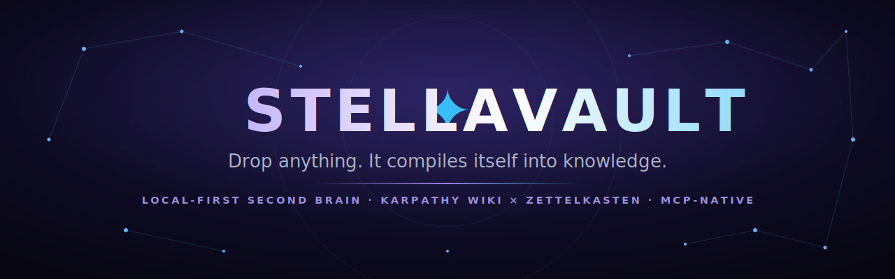

<div align="center">



**让 Claude 记住一切的本地优先第二大脑。**<br/>
Karpathy 的自编译 wiki × 卡片盒笔记法 — 完全本地、仓库非破坏、MCP 原生。

[](https://github.com/Evanciel/stellavault/actions/workflows/ci.yml) [](https://www.npmjs.com/package/stellavault) []() []() [](LICENSE)

[English](README.md) · [한국어](README.ko.md) · [日本語](README.ja.md) · **简体中文**

[**⬇ 下载桌面应用**](https://github.com/Evanciel/stellavault/releases/tag/desktop-v0.2.1) · [**⚡ 快速开始**](#安装) · [**🤖 MCP 配置**](#mcp-集成-21-个工具) · [**🌐 在线演示**](https://evanciel.github.io/stellavault/)

</div>

**一个会自我编译的第二大脑。** Stellavault 把两种关于"知识应当如何存活、生长"的思想融为一体：

- 🧠 **Karpathy 的自编译 wiki** — 丢进任何东西(PDF、YouTube 链接、一闪而过的想法)，它都会被自动抽取进 `raw/`，再**编译**成概念与反向链接井然有序的 `_wiki/`。知识不会烂在文件夹里，而是随着积累不断自我重新编译。
- 🕸️ **卡片盒笔记法(Zettelkasten)** — 原子化笔记、`[[wikilink]]` 与自发涌现的连接，让*一张思想之网*(而非文件夹树)成为你思考的真正骨架。

二者被融合进一个本地优先的知识工具 — 功能完整的 Markdown 编辑器、3D 神经网络图谱、混合 AI 搜索，以及基于间隔重复(spaced repetition)的记忆衰减。而这一切都以 **桌面应用**、**CLI**、**Obsidian 插件**，以及**让 Claude 读取你整个仓库(vault)的 MCP 服务器**的形式提供。无需云端、无需 API 密钥，原始文件永不被修改。

<p align="center">
  
  <br><em>把你的仓库变成一张神经网络。本地优先，无需云端。</em>
</p>

## 目录

[亮点](#亮点) · [为什么选择 Stellavault?](#为什么选择-stellavault) · [安装](#安装) · [编辑器](#编辑器) · [流水线](#流水线) · [智能功能](#智能功能) · [搜索与排名](#搜索与排名) · [MCP 集成](#mcp-集成-21-个工具) · [3D 可视化](#3d-可视化) · [配置](#配置) · [性能](#性能) · [技术栈](#技术栈) · [安全](#安全) · [故障排查](#故障排查)

## 亮点

- 🧠 **它会自我编译。** PDF、YouTube 链接、半成形的想法 — 丢进任何东西，它都会抽取进 `raw/`，再*编译*成概念与反向链接井然有序的 `_wiki/`。随积累自我整理的知识。
- 🔍 **真正能找到的搜索。** 用**加权 RRF** 融合语义、精确关键词(BM25)以及你自己的 `[[wikilink]]` / `#标签`，再用 FSRS 记忆模型重排序，把你*正在用*的笔记顶上来。50+ 种语言、完全本地、零 API 密钥。
- 🌌 **把你的思维变成 3D。** 实时神经网络图谱(React Three Fiber)— 聚类着色、星座、热力图、时间轴、多元宇宙 P2P 视图。一种*看见*自己所知形状的方式。
- 🤖 **Claude 读取你的整个仓库。** 一流的 **MCP 服务器**(21 个工具): 在 Claude Code、Claude Desktop、Cursor、Windsurf、VS Code 中直接搜索、问答、起草、检查与分析。
- ⏳ **它绝不*悄悄*遗忘。** FSRS 记忆衰减把你即将失去的真实笔记顶上来，还能检测整个仓库的知识缺口、矛盾与重复。
- 🔒 **本地优先。仓库非破坏。零密钥。** 本地嵌入 + 设备端向量存储，原始文件**永不被修改**。除非你主动选择，任何数据都不会离开你的机器。

## 为什么选择 Stellavault

大多数工具逼你在*写作*、*搜索*、*记忆*之间三选一。Stellavault 三者兼得 — 在本地，并以 Claude 能读取的方式。

| | **Stellavault** | Obsidian | Notion | 自写 RAG |
|---|:---:|:---:|:---:|:---:|
| 本地优先、离线可用 | ✅ | ✅ | ☁️ 云端 | ⚠️ 通常云端 |
| 无需 API 密钥的语义搜索 | ✅ | ⚠️ 插件+密钥 | 💰 付费 AI | ⚠️ 需密钥 |
| 原始文件永不修改 | ✅ | ✅ | ❌ 专有格式 | ➖ |
| 自编译(摄取 → wiki) | ✅ | ❌ | ❌ | ❌ |
| 3D 知识图谱 | ✅ | 2D / 插件 | ❌ | ❌ |
| 间隔重复衰减(FSRS) | ✅ | ⚠️ 插件 | ❌ | ❌ |
| 缺口 / 矛盾 / 重复检测 | ✅ | ❌ | ❌ | ❌ |
| MCP 原生(Claude 读取你的仓库) | ✅ | ➖ 社区 | ☁️ 云端 | ➖ |

> [!NOTE]
> 并非二选一 — Stellavault 甚至能**在 Obsidian 内**以[插件](https://github.com/Evanciel/stellavault-obsidian)形式运行。留住你的编辑器，加一个大脑。

## 安装

### 桌面应用 (推荐 — 一键搞定)

<table>
  <tr>
    <td align="center"><a href="https://github.com/Evanciel/stellavault/releases/download/desktop-v0.2.1/Stellavault-win32-x64-0.2.1.zip"><br/><b>⬇ 下载 Windows 版</b><br/><sub>x64 · 273 MB · ZIP</sub></a></td>
    <td align="center"><a href="https://github.com/Evanciel/stellavault/releases/download/desktop-v0.2.1/Stellavault-linux-x64-0.2.1.zip"><br/><b>⬇ 下载 Linux 版</b><br/><sub>x64 · 243 MB · ZIP</sub></a></td>
    <td align="center"><br/><b>macOS</b><br/><sub>即将推出</sub></td>
  </tr>
</table>

> [!TIP]
> 下载 → 解压 → 运行 `stellavault.exe`(Windows) 或 `stellavault`(Linux) → 选择笔记文件夹 → 完成。

### CLI (面向开发者)

```bash
npm install -g stellavault    # 或: npx stellavault
stellavault init              # 交互式配置 (3 分钟): 索引仓库 + 连接 AI 客户端
stellavault setup             # 连接 Claude Code/Desktop、Cursor、Windsurf、VS Code (一条命令)
stellavault graph             # 在浏览器中启动 3D 图谱
```

> 需要 Node.js 20+。遇到问题请运行 `stellavault doctor` 进行诊断。

### Obsidian 插件

1. 从 [stellavault-obsidian releases](https://github.com/Evanciel/stellavault-obsidian/releases/latest) 下载 `main.js` + `manifest.json` + `styles.css`
2. 放入 `.obsidian/plugins/stellavault/`
3. 在 设置 → 社区插件 中启用
4. 在仓库文件夹启动 API: `npx stellavault graph`

---

## 编辑器

功能完整的 Markdown 编辑器 — 可与 Obsidian 媲美。

<details>
<summary><b>完整的格式与块支持</b> — 表格、代码、KaTeX、斜杠命令、wikilink、分屏… <i>(点击展开)</i></summary>

<br/>

| 功能 | 状态 |
|---------|--------|
| 加粗、斜体、下划线、删除线 | ✅ |
| 标题 1–6 级 | ✅ |
| 无序、有序、任务列表 (嵌套复选框) | ✅ |
| 表格 (创建、调整列宽、增删行列) | ✅ |
| 带语法高亮的代码块 (40+ 语言) | ✅ |
| 图片 (URL、剪贴板粘贴、拖放) | ✅ |
| KaTeX 数学渲染 (`$E=mc^2$` 行内, `$$...$$` 独立) | ✅ |
| `/斜杠命令` (12 种块, 模糊搜索) | ✅ |
| `[[wikilink]]` 自动补全 | ✅ |
| 分屏视图 (垂直 + 水平, Ctrl+\\) | ✅ |
| 文本对齐 (左 / 中 / 右) | ✅ |
| 高亮、上标、下标 | ✅ |
| 智能排版 (弯引号、em/en 破折号) | ✅ |
| 水平分隔线 | ✅ |

</details>

---

## 流水线

```
捕获 ──→ 整理 ──→ 提炼 ──→ 表达
(Capture ──→ Organize ──→ Distill ──→ Express)

丢进任何东西 → 自动抽取 → raw/ → 编译 → _wiki/ → 草稿
```

灵感来自 Karpathy 的自编译知识架构。

### 摄取(Ingest) 14 种格式

| 输入 | 方式 |
|-------|-----|
| PDF, DOCX, PPTX, XLSX | `stellavault ingest report.pdf` |
| JSON, CSV, XML, YAML, HTML, RTF | `stellavault ingest data.json` |
| YouTube | `stellavault ingest https://youtu.be/...` — 字幕 + 时间戳 |
| URL | `stellavault ingest https://...` — HTML → Markdown |
| 文本 | `stellavault ingest "一闪而过的想法"` |
| 文件夹 | `stellavault ingest ./papers/` — 批量处理所有文件 |
| 桌面 / Web UI | 直接拖放文件 |

### 表达(Express): 把知识取出来

```bash
stellavault draft "AI" --format blog      # 基于仓库的博客文章
stellavault draft "AI" --format outline   # 结构化大纲
stellavault draft "AI" --ai              # Claude API 增强 ($0.03)
```

或使用桌面应用的 **Express 标签页** — 输入主题、选择格式，即可生成一篇以你的仓库为依据的草稿。保存到 `_drafts/` 并行内编辑。

---

## 智能功能

> 这些功能在 Obsidian 中 **并不存在** — 即使装了插件也没有。

| 功能 | 命令 / 桌面 | 说明 |
|---------|-------------------|-------------|
| **记忆衰减(Memory Decay)** | `stellavault decay` / Memory 标签页 | 基于 FSRS — 显示你正在遗忘的真实笔记 |
| **知识缺口(Knowledge Gaps)** | `stellavault gaps` | 检测主题簇之间的薄弱连接 |
| **矛盾(Contradictions)** | `stellavault contradictions` | 发现仓库中互相冲突的表述 |
| **重复(Duplicates)** | `stellavault duplicates` | 带相似度分数的近似重复笔记 |
| **健康检查(Health Check)** | `stellavault lint` | 汇总的仓库健康分 (0–100) |
| **学习路径(Learning Path)** | `stellavault learn` | AI 个性化复习推荐 |
| **每日简报** | 桌面应用主屏 | 推送式: 打开应用即显示衰减最严重的笔记 + 统计 |
| **自动打标签** | 摄取时自动 | 基于内容的关键词抽取 + 分类规则 |
| **自编译** | `stellavault compile` | raw/ → _wiki/，自动抽取概念 + 反向链接 |

---

## 搜索与排名

用 **加权 RRF(Reciprocal Rank Fusion)** 融合多种信号的混合检索 — 专为个人知识仓库调优，完全本地，零 API 密钥:

| 信号 | 捕捉什么 | 默认权重 |
|--------|------------------|---------------:|
| **语义**(dense) | 含义; 多语言 (50+ 种语言) | `1.0` |
| **BM25**(关键词) | 精确词项、代码、名称 | `1.0` |
| **实体链接** | 你的 `[[wikilink]]`、`#标签`、标题、小标题 — 经过精选的图谱 | `1.5` |
| **FSRS 时新性** | 温和地浮现你正在使用 / 正在遗忘的笔记 | `±10%` |

- **实体匹配** 通过模糊子串 + 标点归一化匹配来解析自然语言查询(对韩语 / CJK 友好)。并配有 **单文档多样性上限(per-document diversity cap)**，防止某一篇大笔记霸占搜索结果顶部。
- **时新性** 复用与衰减引擎相同的 FSRS 记忆模型(而非简单的文件修改时间 mtime)— 正在遗忘的笔记会重新浮现，而已掌握的常青笔记不会仅因为"旧"就被埋没。
- **自适应重排序**(长时间运行的 MCP 服务器)还会根据你当前的会话上下文(最近的标签 / 路径)进一步提升结果。
- 每个权重都可按仓库或通过环境变量 **调优** — 参见 [配置](#配置)。

---

## MCP 集成 (21 个工具)

```bash
stellavault setup            # 一条命令 → Claude Code、Claude Desktop、Cursor、Windsurf、VS Code
# 或仅连接 Claude Code:
claude mcp add stellavault -- stellavault serve
```

Claude 可以直接搜索、问答、起草、检查并分析你的仓库。搜索会运行完整的混合流水线 — 对 语义 + BM25 + 实体链接 进行 **加权 RRF**，再加上 **FSRS 时新性** 和会话自适应重排序(详见 [搜索与排名](#搜索与排名))。

| 工具 | 作用 |
|------|-------------|
| `search` | 加权 RRF (语义 + BM25 + 实体) + FSRS 时新性 + 自适应重排序 |
| `ask` | 基于仓库依据的问答 |
| `generate-draft` | 用你的知识生成 AI 草稿 |
| `get-decay-status` | 记忆衰减报告 (FSRS) |
| `detect-gaps` | 知识缺口分析 |
| `create-knowledge-node` | AI 创建 wiki 级别的笔记 |
| `federated-search` | 跨多个仓库的 P2P 搜索 |
| + 另外 14 个 | 文档、主题、决策、快照、导出 |

---

## 3D 可视化

- 带聚类着色的神经网络图谱 (React Three Fiber)
- 星座视图 (MST 星形图案)
- 热力图叠加 + 时间轴滑块 + 衰减叠加
- 多元宇宙视图 — 你的仓库化作 P2P 网络中的一颗宇宙
- 深色/浅色主题

<table>
  <tr>
    <td width="50%"><br/><sub><b>热力图</b> — 各聚类间的连接密度</sub></td>
    <td width="50%"><br/><sub><b>时间轴</b> — 按时间观看仓库的生长</sub></td>
  </tr>
  <tr>
    <td><br/><sub><b>搜索</b> — 在图谱中高亮语义匹配</sub></td>
    <td><br/><sub><b>多元宇宙</b> — 化作环绕轨道的宇宙的联邦仓库</sub></td>
  </tr>
</table>

---

## 立即体验 (演示仓库)

```bash
npx stellavault index --vault ./examples/demo-vault   # 索引 10 篇示例笔记
npx stellavault search "vector database"               # 语义搜索
npx stellavault graph                                  # 3D 图谱可视化
```

演示仓库包含关于 Vector Database、Knowledge Graph、Spaced Repetition、RAG、MCP 等互相关联的笔记 — 非常适合即刻体验所有功能。

---

## 入门指南

### 桌面应用

1. **下载** → 解压 → 运行
2. 首次启动会让你选择笔记文件夹
3. 笔记出现在侧边栏 — 点击即可打开
4. 按 `Ctrl+P` 快速切换文件
5. 点击标题栏的 ✦ 打开 AI 面板 (语义搜索、统计、草稿)
6. 点击 ◉ 查看 3D 图谱

### CLI

```bash
npm install -g stellavault
stellavault init                          # 配置向导
stellavault search "machine learning"     # 语义搜索
stellavault ingest paper.pdf              # 添加知识
stellavault graph                         # 浏览器中的 3D 图谱
stellavault brief                         # 早间简报
stellavault decay                         # 你正在遗忘什么?
```

### 键盘快捷键 (桌面)

| 快捷键 | 操作 |
|----------|--------|
| `Ctrl+P` | 快速切换器 (模糊文件搜索) |
| `Ctrl+Shift+P` | 命令面板 (所有操作) |
| `Ctrl+S` | 保存当前笔记 |
| `Ctrl+\` | 切换分屏视图 |
| `Ctrl+B` | 加粗 |
| `Ctrl+I` | 斜体 |
| `Ctrl+U` | 下划线 |
| `Ctrl+E` | 行内代码 |
| `/` | 斜杠命令 (在行首) |
| `[[` | wikilink 自动补全 |

### 快速参考

| 操作 | 桌面 | CLI |
|--------|---------|-----|
| 搜索笔记 | Ctrl+P 或 AI 面板 | `stellavault search "query"` |
| 添加笔记 | + Note 按钮 或 拖放 | `stellavault ingest "text"` |
| 查看 3D 图谱 | ◉ 按钮 | `stellavault graph` |
| 记忆衰减 | AI 面板 → Memory | `stellavault decay` |
| 生成草稿 | AI 面板 → Draft | `stellavault draft "topic"` |
| 健康检查 | AI 面板 → Stats | `stellavault lint` |

---

## 配置

Stellavault 会读取 `./.stellavault.json`(或 `~/.stellavault.json`)。搜索排名完全可调，开箱即用的默认值就很合理:

```jsonc
{
  "search": {
    "rrfK": 60,
    "weights": { "semantic": 1.0, "bm25": 1.0, "entity": 1.5 },
    "recencyWeight": 0.2,                          // FSRS 时新性强度; 0 = 关闭
    "entityAliases": { "k8s": ["kubernetes"] }     // 同义词 / 跨语言分组 (仅精确匹配)
  }
}
```

环境变量会覆盖配置 (带防护解析):

| 环境变量 | 作用 |
|---------|--------|
| `STELLAVAULT_W_SEMANTIC` / `_BM25` / `_ENTITY` | 各信号的 RRF 权重 (例如 `STELLAVAULT_W_ENTITY=2.0` 让实体更激进地浮现) |
| `STELLAVAULT_RECENCY_WEIGHT` | 时新性强度 `0`–`1` (`0` 表示禁用) |
| `STELLAVAULT_DB_PATH` | 覆盖索引数据库位置 |
| `STELLAVAULT_WATCH` | 设为 `0` 可在 `serve` 运行期间禁用自动重建索引的文件监视器 |

> 注: 跨语言召回(例如用中文查询找到英文笔记)由多语言嵌入模型自动处理 — `entityAliases` 是针对精选实体图谱(标签 / wikilink)和缩写的可选精度增强。

---

## 性能

在合成仓库上测试 — 典型场景下所有操作均在 1 秒以内:

| 操作 | 100 文档 | 500 文档 | 1000 文档 |
|-----------|----------|----------|-----------|
| 存储初始化 | 15ms | 15ms | 16ms |
| 批量 upsert | 12ms | 102ms | ~200ms |
| 搜索 (BM25) | <1ms | <1ms | <1ms |
| 获取全部文档 | <1ms | 2ms | ~4ms |
| 124K 次点积 | — | 36ms | — |

运行你自己的基准测试:

```bash
node tests/stress.mjs 500     # 用 500 篇合成文档测试
```

关键优化:
- **HNSW 图构建** — 对 200+ 文档使用 sqlite-vec KNN (O(n·K·log n) vs O(n²))
- 预归一化向量: 余弦相似度 → 单次点积
- 批量加载嵌入 (每批 500，防止内存溢出)
- 小仓库(< 200 文档)使用上三角暴力计算
- 用类型化数组实现 O(n) 的 K-Means 质心更新

---

## 技术栈

| 层 | 技术 |
|-------|------|
| 桌面 | Electron + React + TipTap (15 个扩展) + Zustand |
| 运行时 | Node.js 20+ (ESM, TypeScript) |
| 向量存储 | SQLite-vec (本地, 零配置) |
| 嵌入 | MiniLM-L12-v2 (本地, 50+ 种语言, 批处理) |
| 搜索 | 加权 RRF (语义 + BM25 + 实体) + FSRS 时新性 |
| 数学 | KaTeX (行内 + 独立) |
| 代码 | lowlight / highlight.js (40+ 语言) |
| 3D | React Three Fiber + Three.js |
| AI | MCP (21 个工具) + Anthropic SDK |
| P2P | Hyperswarm (可选, 差分隐私) |
| CI | GitHub Actions (Node 20 + 22) |

---

## 安全

- **本地优先** — 除非你使用 `--ai`，否则数据不会离开你的机器
- **仓库文件永不修改** — 只索引进 SQLite，原文件保持原样
- **启用 Electron 沙箱** — 渲染进程以受限的操作系统权限运行
- **IPC 路径校验** — 所有文件操作都限制在仓库根目录内
- **API 认证令牌** — 每会话、仅请求头(`X-Stellavault-Token`)。令牌端点仅限同源(same-origin)
- **CORS 白名单** — 默认仅 `localhost` / `127.0.0.1`; MCP HTTP 传输需显式启用
- **SSRF 防护** — 摄取 URL 时屏蔽内网 IP
- **端到端加密** — 云同步采用 AES-256-GCM

### 联邦 (实验性, 默认关闭)

P2P 语义搜索作为 **可选的实验性功能** 提供。默认安装 **不会** 加入任何 swarm，也绝不分享数据。

显式启用:

```bash
# PowerShell
$env:STELLAVAULT_FEDERATION_EXPERIMENTAL = "1"

# bash / zsh
export STELLAVAULT_FEDERATION_EXPERIMENTAL=1

stellavault federate join
```

启用后，联邦使用 Ed25519 身份与签名信封(signed envelope)、双向质询-应答握手、每信封重放随机数(nonce)、握手超时、按节点限速，以及"仅接收"的分享默认值(`myNodeLevel=0`)。要真正与对等节点分享标题/摘要，请在联邦提示符中运行 `set-level 1+`。

> [!WARNING]
> **升级提示 (v0.7.4)** — 联邦传输格式从 v2.0 升级到 v2.1(信封级 nonce)。v0.7.3 的联邦节点不兼容。现有的 `~/.stellavault/federation/sharing.json` **不会** 自动降级为更安全的默认值；若你此前曾选择加入，请复查你的 `myNodeLevel`。

完整细节见 [SECURITY.md](SECURITY.md)。

## 故障排查

```bash
stellavault doctor    # 检查配置、仓库、数据库、模型、Node 版本
```

常见问题:
- **"Command not found"** → `npm i -g stellavault@latest`
- **"API server not found"** → `npx stellavault graph`
- **图谱为空** → `stellavault index`
- **首次运行很慢** → AI 模型首次需下载约 30MB

## 参与贡献

欢迎提交 Issue 和 Pull Request。请参阅 [CONTRIBUTING.md](CONTRIBUTING.md) 开始，并通过 [SECURITY.md](SECURITY.md) 负责任地报告漏洞。

## 许可证

MIT — 全部源代码可供审计。

## 链接

- **[⬇ 下载桌面应用](https://github.com/Evanciel/stellavault/releases/tag/desktop-v0.2.1)**
- [着陆页](https://evanciel.github.io/stellavault/)
- [Obsidian 插件](https://github.com/Evanciel/stellavault-obsidian)
- [npm](https://www.npmjs.com/package/stellavault)
- [GitHub Releases](https://github.com/Evanciel/stellavault/releases)
- [安全策略](SECURITY.md)

---

<div align="center">

**觉得有用?** ⭐ [**给 Stellavault 点星**](https://github.com/Evanciel/stellavault) — 这能实实在在帮助项目触达更多以连接方式思考的人。

<sub>为构建第二大脑的人们，以 ✦ 打造。 · <a href="https://github.com/Evanciel/stellavault/releases">下载</a> · <a href="#mcp-集成-21-个工具">连接 Claude</a> · <a href="https://github.com/Evanciel/stellavault/issues">报告问题</a></sub>

</div>
